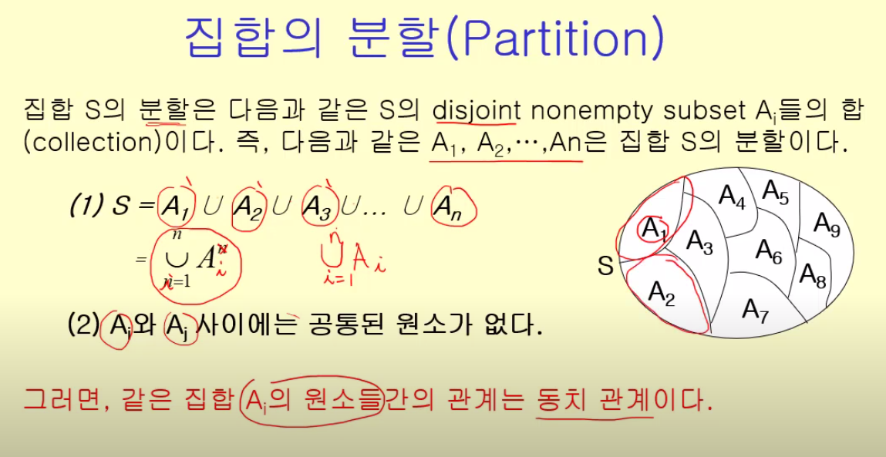
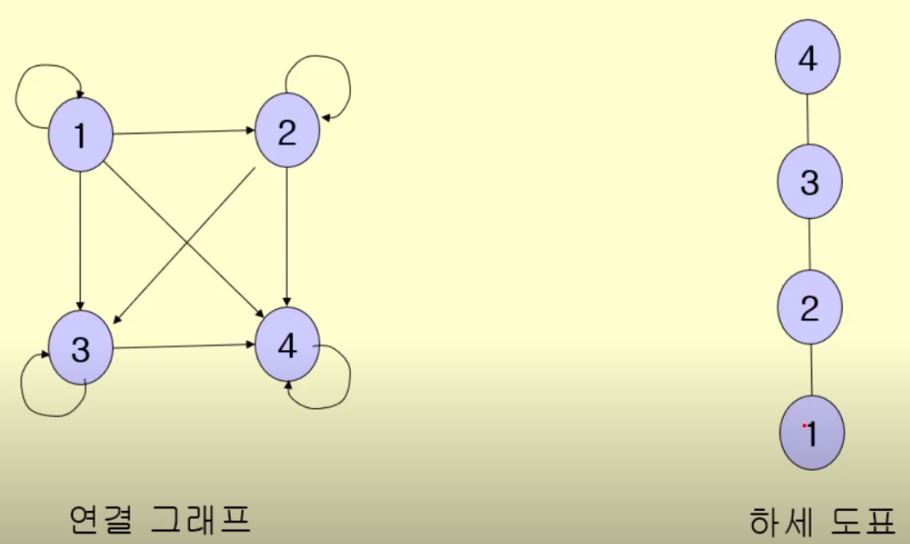

영상: https://www.youtube.com/playlist?list=PLD8rdlfZeJk4n5XQc6bMTZ9eh1C4vGmKQ

### 관계의 정의와 개념
관계는 한 집합 내에서 또는 집합과 집합 사이에서 정의될 수 있다. 

#### 카르테시안 곱

두 개의 집합 A, B가 있을 때 A와 B의 카르테시안 곱은 각각의 집합에 속한 원소 a, b로 이루어진 모든 순서 쌍(a, b)으로 정의된다. 즉 카르테시안 곱은 순서에 관계가 있다.

#### 이진 관계(binary relation)

집합 A, B에 대해서 A로부터의 B로의(A -> B) **이진 관계**는 A X B (**카르테시안 곱)의 부분 집합**으로 정의된다. 즉 관계 R이 존재할 때 순서쌍 (a, b)가 R의 원소이면 a와 b는 R의 관계가 있고 원소가 아니라면 R의 관계가 없다고 할 수 있다.

용어 정리

+ 자기 자신으로의 관계 : R이 A로부터 자기 자신으로의 관계 R: A -> A 라면 R은 **A위에서의 관계**라고 표현한다.
+ 정의역(domain) : R에 속하는 모든 순서쌍의 첫 번째 요소들의 집합
+ 치역(range) : R에 속하는 모든 순서쌍의 두 번째 요소들의 집합
+ 역관계 : R이 집합 A로부터 집합 B로의 관계 (R: A -> B) 라고 할 때 R의 역관계는 R에 속하는 순서쌍들의 순서를 바꾼 순서쌍들로 구성되는 집합이다. ex) R = {(1, a), (2, b), (3, c)} 라면 역관계 R-1 = {(a, 1), (b, 2), (c, 3)} 로 정의된다.

함수와 관계

이진관계 R의 역할이 순서쌍을 매핑하는 것이라면 함수와 같은것이 아닌가? 

+ 함수는 정의역과 치역이 1:1로 매핑된 구조로 하나의 정의역 원소에 대해 여러 개의 치역 원소를 가질 수 없다. 즉 관계로 표현하면 순서쌍의 2번 째 원소는 모든 순서쌍에서 유일한 원소이다.
+ 반면 관계는 하나의 정의역 원소가 여러 개의 치역 원소를 가질 수 있는 1:N 매핑이 가능하다. 
+ 따라서 함수는 관계의 한 형태(관계가 보다 일반적인 개념)라고 할 수 있다.

### 관계의 표현과 합성
#### 관계의 표현

+ 화살 그림(arrow diagram) : 정의역과 치역을 다이어그램으로 표현하고, 관계를 화살표로 표현하는 그림.

  

+ 관계 행렬(relation matrix) : 집합 A, B 사이의 관계를 표현할 때 A와 B의 원소 수를 행과 열로 표현한 행렬에서 관계가 있다면 1 없다면 0으로 표시하는 행렬. 하단 그림 왼쪽의 표현방식. (행이 정의역 열이 치역)

+ 방향 그래프(directed graph) : 관계를 방향이 존재하는 그래프로 표시하는 방식. 하단 그림 오른쪽 표현방식

  

#### 관계의 합성

집합 A, B, C가 존재할 때 관계 R을 A로부터 B로의 관계 (A X B), S를 B로부터 C로의 관계 (B X C)라고 할 때 **합성관계 A로부터 C로의 관계 RS**를 정의할 수 있다. RS의 원소 (a, c)는 R의 원소인 (a, b), S의 원소인 (b, c) 에서 b가 같은 원소로 정의된다. 

### 관계의 유형

이항관계

- 집합 내의 원소들간의 존재할 수 있는 관계에 대한 개념
- 이항 관계는 n항 관계에서 n이 2인 특수 경우 - 우리가 흔히 생각하는 "a는 b보다 크다"와 같은 개념도의 관계의 하위 개념
- 관계를 이야기할 때 함수를 빼놓을 수 없는데 함수는 관계의 하위 개념이면서 동시에 프로그래밍의 꽃
- 함수의 정의 - 첫 번째 집합의 임의의 한 원소를 두 번째 집합의 오직 한 원소에 대응시키는 대응 관계" 이기 때문
- 특이한 관계 - 반사, 대칭, 반대칭, 비대칭, 추이 관계

  - 반사적 관계 : 집합 A위의 관계 R이 모든 A의 원소 a에 대해 (a, a)가 R의 원소이면 관계 R을 반사적 관계(reflexive)라고 한다. ex) A = {1, 2, 3}이라고 하면, (1, 1), (2, 2), (3, 3)의 3가지 원소를 포함하고 있는 관계 R이 있다면 R은 반사적 관계이다.
  - 대칭적 관계 : 집합 A의 모든 원소 a, b에 대해서 (a, b)가 관계 R의 원소일 때 (b, a)가 관계 R의 원소라면 관계 R은 대칭적 관계(symmectric)라고 한다. (a, b)는 R의 원소지만 (b, a)는 R의 원소가 아닌 케이스가 하나라도 존재하면 대칭적이지 않다.
  - 반대칭적 관계 : 집합 A의 모든 원소 a, b에 대해서 (a, b)가 관계 R의 원소이고, (b, a)가 R의 원소일 때, a=b이면 관계 R은 반대칭적 관계(antisymmetric)라고 한다. 즉 a와 b가 다르다면 (a, b), (b, a) 가 배타적 관계여야 한다.
  - 비대칭적 관계 : 집합 A의 모든 원소 a, b에 대해 (a, b)가 관계 R의 원소일 때, (b, a)는 항상 R의 원소가 아니라면 비대칭적 관계(asymmetric)이다. 즉 관계행렬로 나타낼 경우 대각선에 존재하는 원소는 항상 0이다. (a, b), (b, a)가 둘 다 R에 속하는 케이스가  하나라도 있으면 비대칭적이지 않다.
  - 추이적 관계(이행적 관계) : 집합 A의 모든 원소 a, b에 대해 (a, b)가 관계 R의 원소이고 (b, c)가 R의 원소이면 (a, c)가 R의 원소일 때, 관계 R을 추이적 관계(transitive)라고 한다.  (a, b)가 관계 R의 원소이고 (b, c)가 R의 원소지만 (a, c)가 R의 원소가 아닌 케이스가 하나라도 존재하면 추이적 관계가 아니다. 
- 추이관계 - 데이터 베이스의 관계를 제 3 정규형으로 만들기 위해 추이적 함수 종속성을 제거 해야 한다, 그래프에서 경로 개념에서 추이적 관계를 생각 가능: 정점 a와 b(aRb), b와 c(bRc)가 연결되어 있으면 a에서 c로 가는 경로가 존재한다(aRc)는 식으로 생각할 수 있다.

### 관계의 닫힘(Closure)
다음의 조건들이 만족되는 경우 어떠한 **특성 P에 대해 관계 R의 닫힘인 R***를 정의할 수 있다.

+ R* 는 특성 P를 가진다.
+ R ⊆ R* (관계 R은 R*의 부분집합)
+ 즉, R*는 R을 포함하고 특성 P를 가지는 어떠한 다른 관계의 부분 집합이다. (특성 P가 만족되는 관계의 가장 작은 집합)

#### 반사적 닫힘

집합 A상에서 관계 R의 반사적 닫힘(r(R))은 모든 A의 원소 a에 대해 R에 속하지 않은 순서쌍 (a, a)를 R에 추가한 것이다. 

ex.1) A = {1, 2, 3}, R = {(1, 1), (1, 2), (2, 3)} 이라면 R의 반사적 닫힘 R\* 는 (2, 2), (3, 3)을 추가한 다음과 같다. r(R) = {(1, 1), (1, 2), (2, 3), (2, 2), (3, 3)}

ex.2) 정수의 집합에서 관계 R = {(a, b)|a<b} 의 반사적 닫힘은? -> 관계 R에 {(a, a)|a∈Z}을 모두 더해야 하므로 r(R) = {(a, b)|a<=b} 이다.

#### 대칭적 닫힘

집합 A상에서 관계 R의 대칭적 닫힘 s(R)은 모든 R의 원소 (a, b)에 대해 (b, a)가 R에 속하지 않는다면 그것들을 R에 추가한 것이다. 즉 s(R) 은 R과 역관계 R-1의 합집합이다.

ex) A = {1, 2, 3}, R = {(1, 3), (2, 2), (3, 2)} 일 때 s(R)은 R에 (3, 1), (2, 3)을 추가한 관계이다. 즉 s(R) = {(1, 3), (2, 2), (3, 2), (3, 1), (2, 3)}

#### 경로와 연결 관계

**경로(path)** : 집합 S위에서 정의된 관계 R의 방향그래프에서 연속된 (a(i), a(i+1))이 존재할 때 연속된 원소(a(0), a(1), ... , a(k))들을 a(0)로부터 a(k)로의 경로라고 정의한다. 이 때 a(0)부터 a(k)까지의 경로를 구성하는 순서쌍의 개수(화살표의 개수)를 경로의 길이라고 한다.

ex)  A = {1, 2, 3}, R = {(1, 1), (1, 2), (2, 3)} 에서 (1, 2) (2, 3) 이 연속하므로, 1과 3 사이에 경로가 존재하며, 그 경로는 (1, 2, 3)이다. 이 때 경로의 길이는 2 이다.

연결관계(connectivity relation) : 연결관계 R\*은 R\* = {(a, b)|a에서 b로의 경로가 존재} 를 의미하며 R^n으로 표현한다. 이 때 n은 경로의 길이로 R^n은 a에서 b로의 길이 n의 경로를 갖는 순서쌍(a, b)로 구성되는 관계를 말한다. 

 ex) A = {1, 2, 3, 4}, R^1 = {(1, 3), (2, 2), (3, 2), (2, 4)} 인 관계가 존재한다면 R^2는 다음과 같이 표현된다. R^2 = {(1, 2), (3, 4), (3, 2), (2, 2), (2, 4)} 이는 화살표를 2번 타고 이동할 수 있는 순서쌍을 의미한다. 마찬가지로 R^3역시 표현할 수 있다. (화살표 3회 이동으로 표현되는 순서쌍) 

전체 연결관계 R*은 R^1, R^2, ... , R^n 의 합집합으로 표현된다. 이는 방향그래프 상에서 1번부터 n번까지 이동해서 연결되는 모든 경로를 포함하는 집합이다. 

#### 추이적 닫힘

집합 A를 n개의 요소를 가진 집합, R을 A위에서의 관계라고 하면 R의 추이적 닫힘 t(R)은 다음과 같이 정의된다.

t(R) = R∪R^2∪R^3∪...∪R^n 즉 추이적 닫힘은 연결 관계를 만족시키는 순서쌍을 의미한다.

### [동치 관계](/이산-수학/이산수학-기초/동치-관계.md)

집합 S위에서 관계 R이 반사적이고 대칭적이고 추이적이라면, 동치 관계이다. 즉 다음의 세 가지 성질을 가진다.

+ S의 원소인 모든 a에 대해 (a, a)가 R의 원소이다.
+ (a, b)가 R의 원소라면 (b, a)도 R의 원소이다.
+ (a, b)가 R의 원소이고 (b, c)가 R의 원소라면 (a, c)도 R의 원소이다.

#### 동치류(equivalent class)

집합 S위에서 동치 관계인 R이 있을 때, S의 원소 a에 대해서 a와 R관계가 있는 요소들의 집합을 **동치류**라고 한다. 동치류 [a] 는 다음과 같이 표현할 수 있다. [a] = {x|(a, x) ∈ R} 이 때 a를 동치류의 대표(representative)라고 한다.

#### 집합의 분할(partition)

즉 동치관계가 성립하면, 그 동치관계는 집합 S를 분할한다. 

분할의 좋은 예시 = 모듈러 연산 !  동치 관계인 모듈러 연산에 의해, N으로 나누는 경우 집합 S는 나머지가 0, 1, 2, ... , N-1 인 집합들로 분할된다.

### 부분 순서 관계

집합 A위에서 관계 R이 **반사적이고, 반대칭적이고, 추이적**이라면 R은 **부분적 순서 관계**라고 한다. 부분적 순서의 관계를 갖는 요소들의 집합을 부분순서 집합(partially ordered set - poset)이라고 한다. 부분적 순서에서 집합에 있는 요소들의 일부는 상호간 순서가 있으나 모든 요소들 사이에 순서가 있는 것은 아니다.

비교할 수 있다(comparable) : Poset의 두 요소 X, Y는 비교할 수 있다. X, Y간에 부분적 순서 관계가 성립할 때, 관계 R에 대해 X, Y는 비교할 수 있다는 성질을 가진다.

ex) 부분집합관계는 부분 순서 관계이다. 

포셋(poset) : 위에서 언급한 것과 같음, 포셋의 요소들은 **순서 관계가 성립**하므로 먼저 나오는 것과 나중에 나오는 것이 존재한다. 관계 R이 A상에서 부분적 순서이고 x != y인 x, y에 대해 (x, y)가 R의 원소라면 먼저나오는 x를 y의 **선행 요소**, y를 x의 **후행 요소**라고 표현한다.

+ 직전 선행 요소(immediate predecessor) : x가 y의 선행 요소이고 (x, z)가 R의 원소일 때 R의 원소인 (z, y)가 존재하지 않으면 x를 y의 직전 선행 요소라고 한다.

#### 하세 도표(Hasse diagram)

부분 순서 관계를 방향 그래프로 표현하고자 할 때는 모든 연결선을 표시할 필요가 없다. 하세 도표는 불필요한 연결선을 그리지 않고 순서 관계를 나타내는 연결선만으로 구성된 방향 그래프이다. 실제로 그릴 때는 직전 선행 요소를 밑에 후행 요소를 위에 놓은 뒤 연결선을 그리는 방식으로 그린다. 직전 선행 요소가 아니라면 그리지 않는다.

부분 순서 관계를 표현할 때 아래와 같이 연결 그래프를 단순하게 만들 수 있다.

#### 전체 순서(Total order)

집합 A위에서 부분적 순서 관계 R은 A의 모든 서로 다른 요소 a, b에 대해서 (a, b) 가 R의 원소이거나 (b, a)가 R의 원소일 때 R은 전체 순서라고 한다.

ex) 사전의 단어 순서는 전체 순서이다. 어느 두 단어 a, b를 선택해도 a가 b보다 먼저거나 b가 a보다 먼저이기 때문이다.

#### 극대(Maximal)원소 극소(Minimal)원소

 집합 A위에서 부분적 순서 관계(=>)가 존재할 때, A의 원소 a에 대해서 a => b (a != b) 인 b가 존재하지 않을 때 a를 극대 원소라고 한다. 반대로  a => b (a != b) 인 a가 존재하지 않을 때 b를 극소 원소라고 한다.

#### 상한과 하한

+ 상한 : poset 내의 부분 집합의 어떤 원소보다도 큰 원소들
+ 하한 : poset 내의 부분 집합의 어떤 원소보다도 작은 원소들(같은 것도 포함)
+ 최소 상한 : poset 내의 부분 집합 A의 다른 모든 상한보다 작은 상한(상한 집합 중 가장 작은 것)
+ 최대 하한 : poset 내의 부분 집합 A의 다른 모든 하한보다 큰 하한(하한 집합 중 가장 큰 것)

#### 최대(Maximum)와 최소(Minimum)

+ 최대 원소 : poset 내의 다른 어떤 원소보다도 큰 원소(관계의 상한이 여러 개일 경우 존재하지 않음)
+ 최소 원소 : poset 내의 다른 어떤 원소보다도 작은 원소(관계의 하한이 여러 개일 경우 존재하지 않음)

#### 격자(Lattice)

poset의 임의의 두 원소 a, b에 대해서 한 개의 최소 상한과 한 개의 최대 하한이 존재하면 그 poset을 격자라고 표현한다.

ex) 집합 {a, b, c} 의 멱집합 P는 부분집합(관계 R)에 대해 부분 순서관계가 성립한다. poset (P{a, b, c}, R)은 임의의 두 원소에 대해 최소 상한과 최대 하한을 하나씩 가지며, 격자이다.

#### 위상 정렬(Topological sorting)

부분 순서 관계를 지키면서 전체를 정렬하는 것을 의미한다. 관계의 형태에 따라 동일한 순서가 아닐 수 있다. (순서 관계만 지키면 모두 올바른 정렬이기 때문) 집합의 극한 원소(극대 또는 극소)를 계속해서 선택하는 알고리즘을 통해 정렬을 구현할 수 있다.

