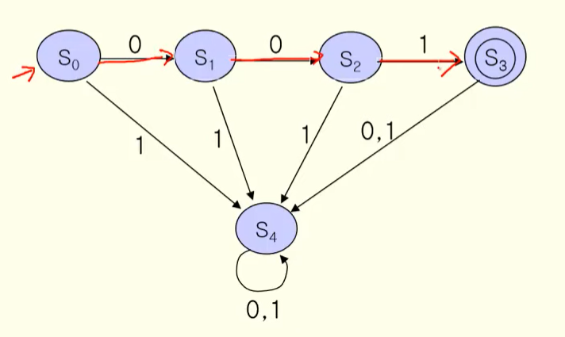
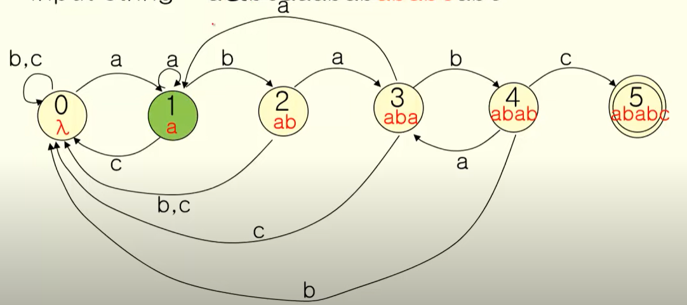
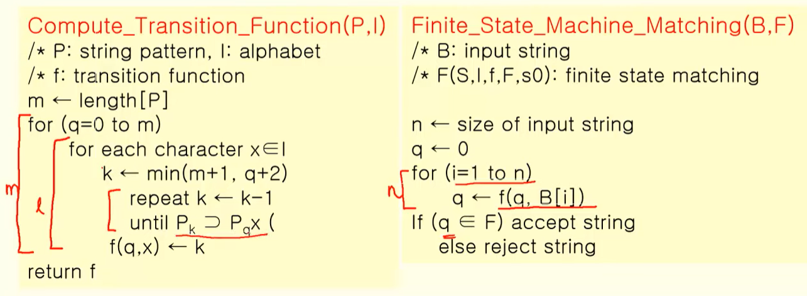

영상: https://www.youtube.com/playlist?list=PLD8rdlfZeJk7aDHa1VxqnX5TyQ4FmgavH

### 형식언어와 문법
#### 언어란?

언어는 기호들과 기호로부터 만들어지는 유한한 문자열로 정의할 수 있다. 

S : 기호들의 집합 - 알파벳, 자음, 모음, 정수와 수학기호 ...

S* : S로부터 만들어지는 유한 문자열 - 문장, 수식 등


#### 언어의 구성요소 정의

+ 1. 기호들의 집합 S가 반드시 존재해야 한다.
+ 2. S로부터 문장들의 집합 S*를 형성하는 규칙(문법)이 반드시 존재해야 한다. - 문법(Syntax)에 대한 내용.
+ 3. 규칙에 합당하게 만들어진 문장들이 의미를 갖는지 결정할 수 있어야 한다. - 의미론(Semantics) 에 대한 내용
+ 즉 기호의 집합, 기호들을 묶는 규칙인 문법, 문법에의해 만들어진 문장이 의미를 가지는지의 요소가 언어를 규정한다. 다만 의미론에 대한 내용은 판단하기가 어렵다는 특징이 있다.


#### 형식언어

문자의 집합을 V 문자들로 이루어진 모든 문자열의 집합을 V*라고 할 때, 형식언어는 V\* 의 부분집합으로 정의한다. 

+ 형식언어를 구성하는 문법을 표현하는 방식

  + 구-구문 문법(phase-structure grammar) : 집합으로 문법을 표현하는 방법(언어학). G = (V, T, S, P)의 형식으로 나타낸다.

    + V - 기호의 집합, T - 단말 기호(N - 비단말 기호), S - 시작 기호, P - 생성 규칙

    + ```
      구-구문문법의 예시
      T = {John, Jill, drives, jogs, carelessly, rapidly, frequently}
      N = {sentence, noun, verbphrase, verb, adverb}
      V = T, N의 합집합
      S = "sentence"
      P: 생성규칙
      	<sentence> => <noun><verbphrase>
      	<noun> => John
      	<noun> => Jill
      	<verbphrase> => <verb><adverb>
      	<verb> => drives
      	<verb> => jogs
      	<adverb> => carelessly
      	<adverb> => rapidly
      	<adverb> => frequently
      ```

    + 위 규칙에 따라서 Jill drives frequently 는 올바른 문법으로 구성된 문장임을 파악할 수 있다.

    + 이러한 형식에 따라 문장을 트리로 나타낼 수도 있으며 이를 **유도 트리(derivation tree)**라고 한다. 단말기호가 트리의 리프가 되고, 비단말 기호가 상위 노드가 되는 구조.

    + 형식언어를 L 문법을 G라고 하면 문법 G를 통해 만들어진 형식언어는 L(G)와 같이 표현할 수 있다.


#### 문법의 종류(촘스키 위계)

+ 유형0 문법(비제한 문법) : 생성규칙에 아무 제약이 없는 문법, 다만 생성규칙의 좌변은 공집합이 아니어야 한다.
+ 유형1 문법(문맥 의존 문법 - Context Sensitive Grammar) : aAb => aXb 형식의 생성규칙을 가지는 문법, A가 X로 대치되는 과정에서 a, b(문맥)가 존재해야 생성이 되므로 문맥 의존 문법이라고 규정되었다. 
+ 유형2 문법(문맥 자유 문법 - Context Free Grammar) : A => a 의 생성규칙을 가지는 문법으로 1유형과 달리 문맥이 없이 자유롭게 대치되는 것을 볼 수 있다. A는 비말단이고 a는 모든 문자열의 집합의 요소이다.
+ 유형3 문법(정규 문법 - Regular Grammar) : A => aB, A => a 의 생성규칙을 가지는 문법, A와 B는 비말단, a는 말단이다. 
+ 각 유형의 문법은 낮은 번호를 가지는 문법의 부분집합으로 다음의 형태로 나타낼 수 있다.
+ 
+ 프로그래밍 언어의 경우 유형2 문법의 범위 내에서 모두 표현이 가능하다.


#### 문법의 표현

+ BNF(Backus-Naur Form) 형식 
  + 비단말 기호를 <a\> 와 같이 브래킷으로 표현하고
  + 생성규칙 => 은 ::= 로 표헌한다.
  + 하나의 비단말 기호로부터 생성되는 여러 개의 문자열은 |로 구분한다.
  + ex) P : v => aw, w => bbw, w => c 를 BNF 형식으로 표현하면?
  + <v\> ::= a<w\>, <w\> ::= bb<w\>|c 와 같이 나타낸다.
+ 문법 다이어그램(Syntax Diagram)
  + 비단말기호는 사각형, 단말기호는 원으로 표현
  + 생성과정은 화살표로 표현한다.
  + 하나의 비단말 기호로부터 생성되는 여러 개의 문자열은 병렬로 놓고 화살표로 표시한다.
  + 프로그래밍 언어의 함수를 표현하는 문법 다이아그램 예시
  + 
+ 유도 트리(Derivation Tree)
  + 비단말기호, 단말기호를 노드로 하는 트리의 형식으로 생성규칙을 나타낸 것
  + 

### 정규식과 정규문법
#### 정규식의 정의

+ I 를 기호들의 집합(alphabet) 이라고 하면, I에서 정의되는 정규식은 다음과 같이 재귀적으로 정의된다.
  + 공문자열 λ는 정규식이다.
  + a가 I의 원소이면 a는 정규식이다.
  + a와 b가 각각 정규식이면 ab(concatenation) 도 정규식이다.
  + a와 b가 각각 정규식이면 a+b(or 개념) 도 정규식이다.
  + a가 정규식이면 a*도 정규식이다. (\*는 반복을 의미함)
+ ex) I = {0, 1} 일 때 (0+1)(0+1)*의 정규식은 ? => 0과 1로 이루어진 모든 문자열!
+ 0(0+1)*1의 정규식은? => 0으로 시작해서 1로 끝나는 모든 문자열!


#### 정규 집합(regular set)

+ 기호들의 집합 I에서 특정 정규식으로부터 만들어지는 모든 문자열의 집합 I*를 정규 집합이라고 정의한다.
+ ex) I = {a, b, c} 이고 정규식이 a*라면 정규집합은 I\*={λ, a, aa, aaa, aaaa, aaaaa, ...}


#### 정규 문법

+ 정규 문법은 정규식으로 표현될 수 있으며, 정규 문법에 의해 생성되는 언어는 정규식에 의해 만들어지는 정규 집합과 동일하다.
+ I -G(정규 문법)-> I* 의 관계, L(G) = I* 로 표현할 수 있다.
+ BNF 형식이나 다이어그램으로 표현된 생성 규칙은 정규식의 형태로 변환할 수 있다.
+ ex) <v\> ::= a<w\>, <w\> ::= bb<w\>|c 의 BNF 형식 생성 규칙을 정규식으로 표현하면? => a(bb)*c 와 동일하다.


### 유한상태기계
컴퓨터 프로그램 및 논리 회로를 설계하는데 사용되는 수학적 모델의 하나. 유한한 개수의 상태를 가질 수 있는 오토마타로, 한 번에 오로지 하나의 상태만을 가진다. 유한상태기계는 다음의 세 가지 요소로 정의할 수 있다.

+ S : 상태의 집합(a set of states)
+ I : 입력값의 집합(a set of inputs)
+ f : 상태 추이 함수(state transition function)

즉, 유한상태기계는 입력값에 따라 현재 상태에서 다른 상태로 변화하는(transition) 기계이다.

ex) flip-flop 기계 => f(0, 0) = 0, f(0, 1) = 1, f(1, 0) = 0, f(1, 1) = 1


#### 유한상태기계의 유형

+ 출력이 있는 유한상태기계

  + 1. 출력이 상태 추이 함수에 의해 결정

  + 2. 출력이 상태에 의해 결정

    + Moore machine 이 2번의 예시.

  + 정의

    + 기존 유한상태기계에 다음의 요소들을 추가하여 정의할 수 있다.
    + O : 유한의 출력 기호
    + g : 출력 함수
    + s0 : 초기 상태
    + 즉 (S, I, O, f, g, s0)로 표현된다.

  + 입력값에 따른 전이가 정의되어 있고, 특정 상태에서 입력값에 따른 출력값도 존재하는 형태

  + ex) 자동판매기 - 누적된 돈을 상태, 투입하는 동전 및 음료 버튼을 인풋으로 생각하면 출력이 있는 유한상태기계로 볼 수 있다.  (특히 1번 형태)

+ 출력이 없는 유한상태기계(Finite-State Automata)

  + 유한 상태 오토마타(Finite-state automate)라고도 한다.
  + 출력이 없고 최종 상태의 집합이 존재한다.
  + 즉, 유한 상태 오토마타는 시작 상태에서 최종 상태에 도달하게 하는 입력값들만 인식한다.
  + 언어를 인식하는 기계를 모델링할 때 사용된다.
  + 정의
    + S : 유한한 상태 집합
    + I : 유한한 입력 알파벳의 집합
    + f : 상태 추이 함수
    + s0 : 초기 상태
    + F : 최종 상태의 집합
    + 즉 (S, I, f, s0, F)로 표현된다.

+ Turing Machine 등등


### 오토마타와 언어

<details>
<summary>오토마타</summary>
계산 능력이 있는 추상 기계와 그 기계를 이용해서 풀 수 있는 문제들을 연구하는 분야  
형식 언어를 정의하는 관점에서 컴파일러에서 구분 분석을 하면서 추상 구문 트리를 생성할 때  
계산 능력을 가진 추상 기계를 논하는 관점에서 계산 이론적으로 P-NP문제와도 연관성 있음
</details>


#### 유한 상태 오토마타와 언어

오토마타 M이 있고, I*에 속하는 문자열 W가 M에 입력될 때, **시작 상태 s0에서 최종상태 F로 이동**하면 문자열 W는 기계 M=(S, I, f, s0, F)이 **인식 또는 승인**한다고 표현한다. 기계 M에 의해서 인식되는 문자열의 집합을 M에 의해 인식되는 언어 L(M) 라고 정의한다.

위 정의로부터 다시 생각하면 L(M) 은 M이라는 오토마타에 의해 인식되는 모든 문자열과 같다. 이 때 언어 L(M)은 언어에 대응하는 **정규 문법**을 만들 수 있다. M에 대응하는 정규 문법을 G라고 하면 문법 G에 의해서 생성되는 언어와 M에서 인식되는 문자열의 집합은 동일함을 알 수 있다. 즉 **L(M) 과 L(G)** 는 동일하다.

따라서 유한 상태 오토마타는 유형 3 문법으로 만들어진 언어를 인식하는 기계라고 할 수 있다.

+  추가로, 유형 2 문법에 대응되는 오토마타는 pushdown automata(PDA)
+ 유형 1 문법에 대응되는 것은 튜링 머신이다.


#### M에서 G만들기

유한 상태 오토마타 M이 주어졌을 때 이에 대응하는 정규 문법 G를 만들 수 있다.

+ M=(S, I, f, s0, F) => G=(V, T, S, P)
+ S => N(비단말 기호)
+ I => T(단말 기호)
+ V는 N과 T의 합집합이므로 S, I가 V로 변환
+ P : 생성 규칙
  + Si, Sj 가 S의 원소이고, x가 I의 원소일 때
  + fw(Si) = Sj 이면 Si => wSj
  + fw(Si) 가 F의 원소이면 Si => w (유형 3 문법의 정의)


#### 주어진 문제를 해결하는 유한상태 오토마타 만들기

M에서 G만들기와 반대로, 일반언어 / 정규식 / BNF로 기술된 언어가 있다면, 이 언어를 해석하는 유한 상태 오토마타를 설계할 수도 있다.

ex) 0과 1로 이루어진 입력 스트링 001을 인식하는 유한 상태 오토마타를 설계한다면?

+ I = {0, 1} L(M) = {001}
+ 


#### 최적 오토마타 설계

우선 오토마타를 설계하였다면, 그 다음 과정은 오토마타를 최적화하는 것이다. 최적화된 오토마타란 가능한 적은 state를 가지는 automata를 의미한다.


#### 결정 오토마타(DFA) / 비결정 오토마타(NFA)

+ 결정 오토마타 : 입력값에 대해서 전이되는 상태가 정확하게 결정되는 오토마타.

+ 비결정 오토마타 : 입력값에 대해서 상태 전이가 다수 존재하거나 발생하지 않을 수 있는 오토마타.

+ ex) I = {0, 1}, L(M) : 1로 시작해서 1로 끝나는 문자열 - 에 해당하는 오토마를 설계하는 경우이다. 위는 DFA, 아래는 NFA

+ | 상태           | 0    | 1    |
  | -------------- | ---- | ---- |
  | s0             | s3   | s1   |
  | s1             | s1   | s2   |
  | s2(F)          | s1   | s2   |
  | s3(Dead state) | s3   | s3   |

+ | 상태  | 0     | 1        |
  | ----- | ----- | -------- |
  | s0    | 전이x | {s1}     |
  | s1    | s1    | {s1, s2} |
  | s2(F) | 전이x | 전이x    |

+ DFA와 NFA는 서로 변환될 수 있다.

  

### 스트링 매칭 알고리즘

입력된 문자열에서 정해진 패턴을 찾는 알고리즘을 의미한다. 검색 또는 파싱 등에 응용되는 알고리즘으로 여기서는 오토마타를 활용하는 스트링 매칭 알고리즘을 설명.

특정 문자열을 찾는 오토마타를 설계해본다면?

+ ex) I = {a, b, c} 에서 ababc 라는 문자열을 찾는 오토마타를 설계해보자.

+ 

+ 

+ 좌측은 각 상태에서 알파벳을 입력했을 때 몇 개의 자리가 일치하는지(어느 상태로 전이되는지)를 표현하는 함수인 Transition functions을 구하는 알고리즘 / 우측은 구한 함수를 이용하여 적용하는 것을 나타낸다.

  

### 셈(순열과 조합) - 곱의 법칙과 합의 법칙

+ 셈(Counting) : 어떤 사건이 발생할 수 있는 경우의 수를 계산하는 것, 확률을 계산할 때 반드시 필요한 과정
+ 두 개의 사건이 있을 때 서로 연계된 경우와 아닌 경우를 생각할 수 있다. 연계된 경우에는 **곱의 법칙**을 적용하고 아닌 경우에는 **합의 법칙**을 사용하요 경우의 수를 계산하게 된다.
+ 각 사건의 경우의 수가 n1, n2라고 할 때, 연계된 경우 경우의 수는 n1 * n2 (곱의 법칙)
+ 연계되지 않은 경우 경우의 수는 n1 + n2 (합의 법칙)

+ 포함-배제 원리 : 합의 법칙을 적용할 때 중복되어 계산된 경우를 고려하는 것을 의미한다. 단순히 합의 법칙을 적용한 후 교집합에 해당하는 경우의 수를 빼주는 것을 말함.

  
